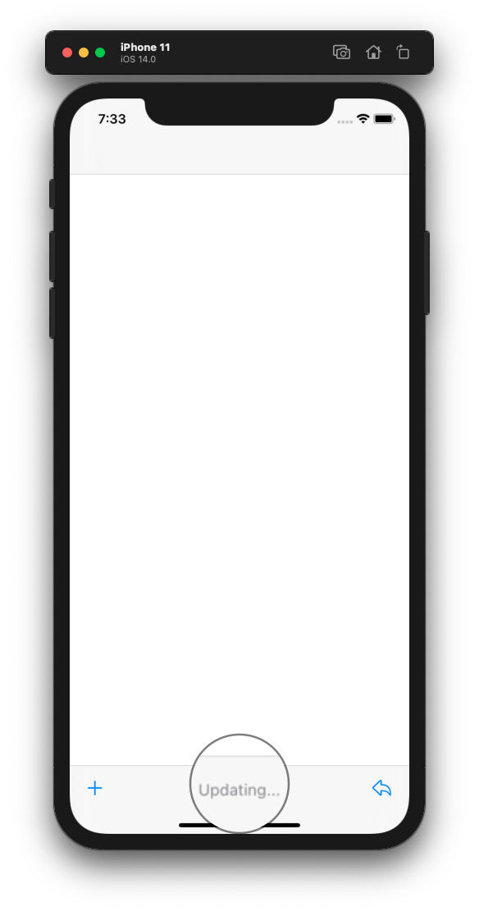

# A11yTest

>Edit :- 8th OCT 2020

>Finally found a fix, it turns out issues with storyboard. When i created the same view from scratch it was working perfectly.

Custom `UIBarButtonItem` is failing to read out by voice over.

I have the below setup, tool bar is having 2 system icons with images, 2 flexible space bar button items and a custom view with label and progressview.

Voice over was able to pickup the system buttons without any issues once I set `accessibilityEnabled` to `true` and set `accessibilityLabel` string value.

However, for my `UIBarButtonItem` with custom view with a label is failing to be accessed by VoiceOver.

I have tried setting up `accessibilityEnabled` and `accessibilityLabel` to below items and never get it working

- Setting to `UIBarButtonItem` object
- Setting to my custom refresh view with label
- Setting via Storyboard
